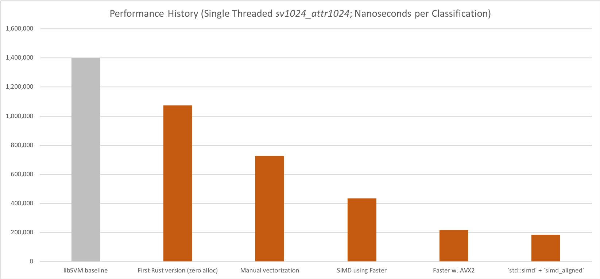

[![Latest Version]][crates.io]
[![Travis-CI Status]][travis]
[![docs]][docs.rs]
![MIT]

# In One Sentence

You trained a SVM using [libSVM](https://github.com/cjlin1/libsvm), now you want the highest possible performance during (real-time) classification, like games or VR.


# Highlights

* loads almost all [libSVM](https://github.com/cjlin1/libsvm) types (C-SVC, ν-SVC, ε-SVR,  ν-SVR) and kernels (linear, poly, RBF and sigmoid)
* produces practically same classification results as libSVM
* optimized for [SIMD](https://github.com/rust-lang/rfcs/pull/2366) and can be mixed seamlessly with [Rayon](https://github.com/rayon-rs/rayon)
* written in 100% Rust, but can be loaded from any language (via FFI)
* allocation-free during classification for dense SVMs
* 2.5x - 14x faster than libSVM for dense SVMs
* on-par performance with libSVM for sparse SVMs
* extremely low classification times for small models (e.g., 128 SV, 16 dense attributes, linear ~ 500ns)
* successfully used in Unity and VR projects (Windows & Android)
* free of `unsafe` code ;)


# Principal Usage

Train with [libSVM](https://github.com/cjlin1/libsvm) (e.g., using the tool `svm-train`), then classify with `ffsvm-rust`.

From Rust:

```rust
// Load model file / SVM.
let model: &str = include_str!("model.libsvm");
let svm = SVM::try_from(&model)?;

// Produce problem we want to classify.
let mut problem = Problem::from(&svm);

// Set features. You can also re-use this `Problem` later. If you do
// no further allocations happen beyond this point.
problem.features_mut().clone_from_slice(&[
    0.3093766, 0.0, 0.0, 0.0, 0.0, 0.1764706, 0.0, 0.0, 1.0, 0.1137485,
]);

// Can be trivially parallelized (e.g., with Rayon) ...
svm.predict_value(&mut problem);

// Results should match libSVM
assert_eq!(SVMResult::Label(42), problem.label());
```

From C / FFI:

Please see [FFSVM-FFI](https://github.com/ralfbiedert/ffsvm-ffi)


# Status

* **Aug 5, 2018**: Still in alpha, but finally on crates.io.
* **May 27, 2018**: We're in alpha. Successfully used internally on Windows, Mac, Android and Linux
on various machines and devices. Once SIMD stabilizes and we can cross-compile to WASM
we'll move to beta.
* **December 16, 2017**: We're in pre-alpha. It will probably not even work on your machine.


# Performance


Classification time vs. libSVM for dense models.



Performance milestones during development.

All performance numbers reported for the `DenseSVM`. We also have support for `SparseSVM`s, which are slower for "mostly dense" models, and faster for "mostly sparse" models (and generally on the performance level of libSVM).


[See here for details.](https://github.com/ralfbiedert/ffsvm-rust/blob/master/docs/performance.md)


# FAQ

[See here for details.](https://github.com/ralfbiedert/ffsvm-rust/blob/master/docs/FAQ.md)


[travis]: https://travis-ci.org/ralfbiedert/ffsvm-rust
[Travis-CI Status]: https://travis-ci.org/ralfbiedert/ffsvm-rust.svg?branch=master
[Latest Version]: https://img.shields.io/crates/v/ffsvm.svg
[crates.io]: https://crates.io/crates/ffsvm
[MIT]: https://img.shields.io/badge/license-MIT-blue.svg
[docs]: https://docs.rs/ffsvm/badge.svg
[docs.rs]: https://docs.rs/crate/ffsvm/
